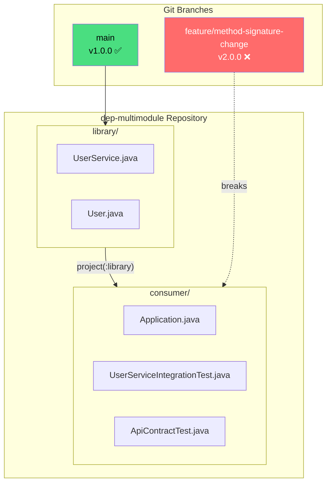
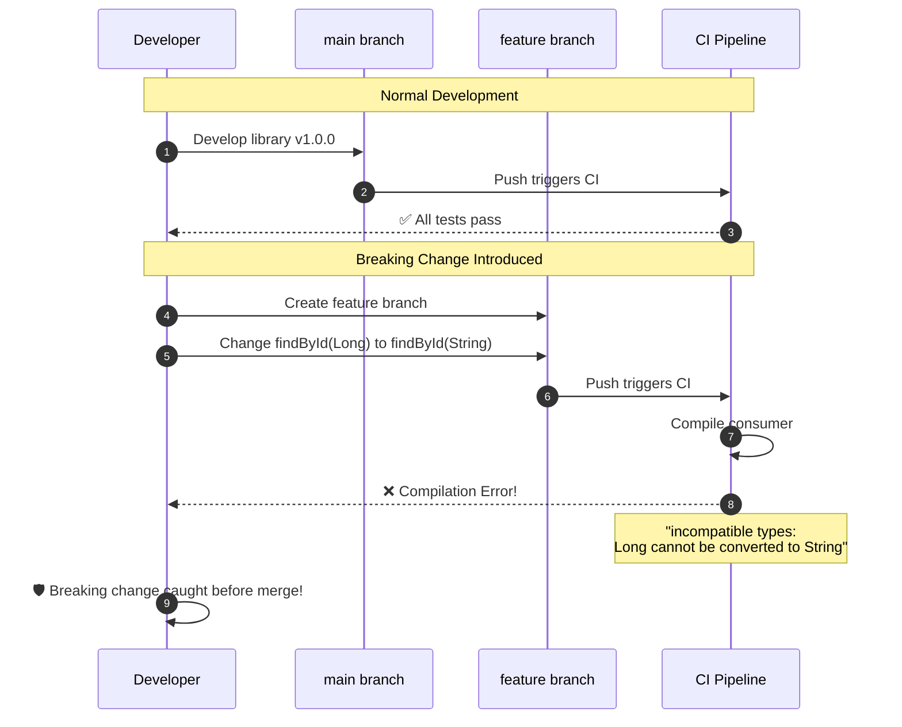
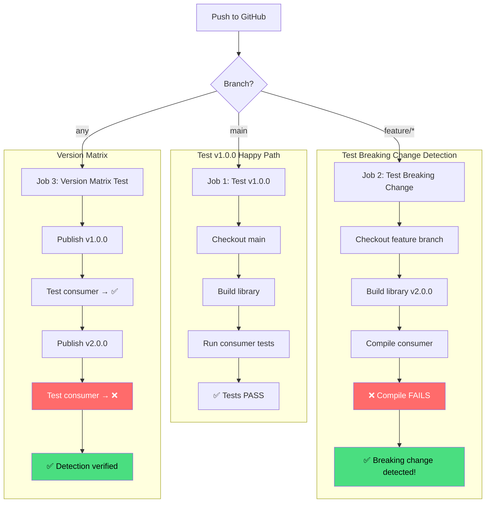

# dep-multimodule

A multi-module Gradle project demonstrating how integration tests detect breaking API changes in dependencies.

[](https://github.com/pravasna30-dev/dep-multimodule/actions/workflows/ci.yml)

## Overview

This project contains both a **library** and a **consumer** in a single repository, demonstrating how consumer tests act as an **early warning system** for breaking API changes.

| Branch | Version | API Status |
|--------|---------|------------|
| `main` | v1.0.0 | ✅ Stable API |
| `feature/method-signature-change` | v2.0.0 | ❌ Breaking Changes |

## 📺 Terminal Demo

<details>
<summary><b>Click to expand: Happy Path (v1.0.0)</b></summary>

```
┌──────────────────────────────────────────────────────────────────┐
│ $ cd dep-multimodule                                             │
│ $ git checkout main                                              │
│ Switched to branch 'main'                                        │
│                                                                  │
│ $ ./gradlew :consumer:test                                       │
│                                                                  │
│ > Task :library:compileJava                                      │
│ > Task :library:processResources NO-SOURCE                       │
│ > Task :library:classes                                          │
│ > Task :library:jar                                              │
│ > Task :consumer:compileJava                                     │
│ > Task :consumer:processResources NO-SOURCE                      │
│ > Task :consumer:classes                                         │
│ > Task :consumer:compileTestJava                                 │
│ > Task :consumer:processTestResources NO-SOURCE                  │
│ > Task :consumer:testClasses                                     │
│ > Task :consumer:test                                            │
│                                                                  │
│ UserServiceIntegrationTest > FindByIdContract > shouldFind...    │
│   PASSED                                                         │
│ UserServiceIntegrationTest > FindByIdContract > shouldReturn...  │
│   PASSED                                                         │
│ ApiContractTest > verifyFindByIdSignature                        │
│   PASSED                                                         │
│                                                                  │
│ BUILD SUCCESSFUL in 5s                                           │
│ 7 actionable tasks: 7 executed                                   │
│                                                                  │
│ ✅ All tests pass with v1.0.0 API                                │
└──────────────────────────────────────────────────────────────────┘
```
</details>

<details>
<summary><b>Click to expand: Breaking Change Detection (v2.0.0)</b></summary>

```
┌──────────────────────────────────────────────────────────────────┐
│ $ git checkout feature/method-signature-change                   │
│ Switched to branch 'feature/method-signature-change'             │
│                                                                  │
│ $ ./gradlew :consumer:test                                       │
│                                                                  │
│ > Task :library:compileJava                                      │
│ > Task :library:jar                                              │
│ > Task :consumer:compileJava FAILED                              │
│                                                                  │
│ FAILURE: Build failed with an exception.                         │
│                                                                  │
│ * What went wrong:                                               │
│ Execution failed for task ':consumer:compileJava'.               │
│ > Compilation failed; see the compiler error output for details. │
│                                                                  │
│ ┌─────────────────────────────────────────────────────────────┐  │
│ │ error: incompatible types: Long cannot be converted to      │  │
│ │        String                                               │  │
│ │     User user = userService.findById(userId);               │  │
│ │                                      ^                      │  │
│ │                                                             │  │
│ │ error: incompatible types: Optional<User> cannot be         │  │
│ │        converted to User                                    │  │
│ │     User user = userService.findById(userId);               │  │
│ │     ^                                                       │  │
│ └─────────────────────────────────────────────────────────────┘  │
│                                                                  │
│ BUILD FAILED in 2s                                               │
│                                                                  │
│ ❌ Breaking change detected! Consumer won't compile.             │
└──────────────────────────────────────────────────────────────────┘
```
</details>

## Architecture



## Breaking Change Flow



## API Versions

### v1.0.0 (main branch)

```java
public class UserService {
    public User findById(Long userId);     // Returns null if not found
    public List<User> findAll();
    public User createUser(String email, String name);
}

public class User {
    public Long getId();
    public String getEmail();
    public String getName();
}
```

### v2.0.0 (feature branch) - Breaking Changes

```java
public class UserService {
    public Optional<User> findById(String userId);  // ⚠️ BREAKING
    public List<User> findAll();
    public User createUser(String email, String name);
}

public class User {
    public String getId();  // ⚠️ BREAKING: Long → String
    public String getEmail();
    public String getName();
}
```

## Local Development

### Prerequisites

- Java 21+ (JDK, not JRE)
- Gradle 8.5+ (wrapper included)

### Quick Start

```bash
# Clone the repository
git clone https://github.com/pravasna30-dev/dep-multimodule.git
cd dep-multimodule

# Run tests (v1.0.0 - should pass)
git checkout main
./gradlew :consumer:test

# Try breaking changes (v2.0.0 - should fail)
git checkout feature/method-signature-change
./gradlew :consumer:test
```

### Test Against Published Versions

```bash
# Publish v1.0.0 to Maven Local
git checkout main
./gradlew :library:publishToMavenLocal -Pversion=1.0.0

# Test consumer against v1.0.0
./gradlew :consumer:test -PusePublishedLibrary -PlibraryVersion=1.0.0

# Publish v2.0.0 and test (will fail)
git checkout feature/method-signature-change
./gradlew :library:publishToMavenLocal -Pversion=2.0.0

git checkout main
./gradlew :consumer:test -PusePublishedLibrary -PlibraryVersion=2.0.0
```

## CI/CD Pipeline



### Trigger CI Manually

```bash
gh workflow run ci.yml --repo pravasna30-dev/dep-multimodule
gh run list --repo pravasna30-dev/dep-multimodule
```

## Test Types

| Test Type | File | Detection | Failure Mode |
|-----------|------|-----------|--------------|
| **Integration** | `UserServiceIntegrationTest.java` | Compile-time | `incompatible types` |
| **Contract** | `ApiContractTest.java` | Runtime | `NoSuchMethodException` |

### Integration Test Example

```java
@Test
void shouldFindExistingUserByLongId() {
    Long userId = 1L;  // Explicit type
    User user = userService.findById(userId);  // Breaks if param changes
    assertThat(user.getId()).isEqualTo(1L);    // Breaks if return type changes
}
```

### Contract Test Example

```java
@Test
void verifyFindByIdSignature() throws NoSuchMethodException {
    Method method = UserService.class.getMethod("findById", Long.class);
    assertThat(method.getReturnType()).isEqualTo(User.class);
}
```

## Project Structure

```
dep-multimodule/
├── build.gradle.kts              # Root build config
├── settings.gradle.kts           # Includes library & consumer
├── gradle.properties             # Version properties
│
├── library/
│   ├── build.gradle.kts          # java-library + maven-publish
│   └── src/main/java/
│       └── com/example/library/
│           ├── User.java
│           └── UserService.java
│
├── consumer/
│   ├── build.gradle.kts          # application plugin
│   └── src/
│       ├── main/java/
│       │   └── com/example/consumer/
│       │       └── Application.java
│       └── test/java/
│           └── com/example/consumer/
│               ├── UserServiceIntegrationTest.java
│               └── ApiContractTest.java
│
├── docs/                         # Documentation
│   └── index.html               # GitHub Pages
│
└── .github/
    └── workflows/
        └── ci.yml               # CI pipeline
```

## Related Repositories

| Repository | Description |
|------------|-------------|
| [dep-library](https://github.com/pravasna30-dev/dep-library) | Standalone library (Use Case 2) |
| [dep-consumer](https://github.com/pravasna30-dev/dep-consumer) | Standalone consumer (Use Case 2) |

## Documentation

📚 [View Full Documentation](https://pravasna30-dev.github.io/dep-multimodule/)

## License

MIT
